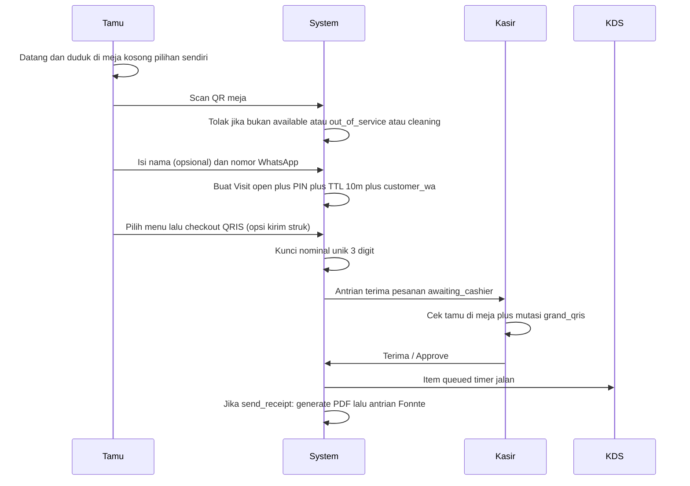

# Landasan Produksi — Tahap 1 (Walk-In Operasional)

Dokumen ini adalah spesifikasi operasional yang diimplementasi. Proposal lengkap (`proposal development.docx`) tetap menjadi visi produk; **tahap 1 tidak mengerjakan booking**.

Alur tamu yang diimplementasi (tanpa booking):

**datang → duduk di meja pilihan sendiri → scan QR meja → isi nomor WA → pilih menu → pesan (QRIS atau tunai) → kasir terima pesanan → struk WA (opsional) → dapur masak.**

CMS landing page tetap dikerjakan. GPS geofence tetap dikerjakan, **hanya untuk pembayaran tunai**.

---

## 1. Keputusan terkunci

| Keputusan | Isi |
|---|---|
| Produk tahap 1 | Walk-in self-order + CMS landing + kasir + KDS. **Booking/reservasi/DP/e-ticket dikeluarkan.** |
| Alur tamu | Datang, duduk di meja pilihan sendiri, scan QR, isi nomor WhatsApp, pilih menu, pesan. Kasir menerima. Struk digital opsional ke WA (Fonnte). |
| Verifikasi bayar | Kasir approve semua (QRIS statis + tunai). Dapur hanya setelah `paid`. |
| Struk WhatsApp | Setiap resto punya API key Fonnte sendiri di restaurant settings. Kirim struk WA **hanya jika owner sudah mengisi key**. |
| Anti-ghost tunai | GPS geofence (radius 30 m). QRIS tidak memakai GPS. |
| Payment gateway | Tidak di tahap 1. Interface pembayaran disiapkan terpisah agar nanti tinggal toggle. |
| Klaim meja | Duduk dulu itu perilaku lapangan yang benar. Sistem mengunci meja saat scan QR berhasil. |
| Multi-HP | Satu Visit per meja. HP kedua harus gabung (PIN), bukan buka sesi baru. |
| Denah | Daftar meja + QR, **bukan** drag-and-drop layout builder. |
| Runner tablet | Tidak ada aplikasi terpisah. Status `served` dari KDS atau kasir. |

---

## 2. Modul tahap 1 vs ditunda

### Dikerjakan sekarang

1. **Auth staf** — login email/username + password. Role & permission memakai **Filament Shield** (tabel Spatie: `roles`, `permissions`, `model_has_roles`, …). Seed tahap 1: `super_admin` (platform), `owner`, `kasir`, `dapur`. Teams Spatie: `team_foreign_key = restaurant_id`. Izin bisnis yang sama: `order.create`, `order.verify_payment`, `order.reject_payment`, `order.void`, `table.manage`, `kds.view`, `kds.update_status`, `menu.manage`, `cms.manage`, `settings.manage`, `audit.view` (nama akhir mengikuti format Shield).
2. **Pengaturan resto + outlet** — Restaurant: nama, slug, logo, timezone, currency, **API key Fonnte** (terenkripsi, per resto). Outlet default: alamat, Open/Closed, jam operasional, libur khusus, koordinat GPS, radius geofence, foto QRIS, pajak PB1 %, service charge %, mode **tax exclusive**.
3. **CMS landing page** — halaman publik: profil, galeri, peta, jam buka, FAQ, banner promo berjangka. Tanpa form reservasi (booking ditunda). CTA: arahkan ke lokasi / jam buka, bukan “pesan meja”.
4. **Meja + QR** — CRUD meja (nomor, kapasitas, area teks bebas). QR berisi signed token (`/order/t/{signed_token}`), unduh PNG/PDF stiker.
5. **Menu** — kategori, item (nama, harga, foto, deskripsi, aktif, out of stock), varian, modifier berbayar, catatan per item, stasiun produksi (tabel `kds_stations`; seed dapur + bar).
6. **Tamu (web HP)** — scan QR meja, **isi nomor WA** (wajib, disimpan di Visit), katalog, keranjang, checkout QRIS/tunai + GPS pada tunai, opsi kirim struk, pantau status item. Tanpa registrasi akun.
7. **Kasir / FOH** — antrian bayar, approve/reject, override GPS tunai, papan meja, buat order (tamu tanpa HP + isi WA), void, pindah meja, tutup Visit, tandai cleaning.
8. **KDS** — layar dapur dan/atau bar, timer, suara pesanan baru, ubah status item, tampilan batch (agregat, bukan status).
9. **Struk digital + Fonnte** — PDF struk per order `paid`; kirim WA hanya jika `restaurants.fonnte_api_key_encrypted` terisi; antrian `whatsapp_messages`; gagal kirim tidak membatalkan pesanan; tombol kirim ulang di kasir.
10. **Audit log** — append-only untuk aksi sensitif (lihat §8).
11. **Laporan harian tipis** — omzet `paid` (tunai vs QRIS), jumlah order, void. Bukan P&L.

### Tidak dikerjakan di tahap 1

Booking & DP, e-ticket reservasi, layout builder, ulasan, inventaris/resep/HPP, OpEx, P&L lengkap, heatmap, runner app, Midtrans/Xendit (kolom `payments.provider` sudah disiapkan), tax inclusive. Multi-cabang: **skema sudah ada**; UI tahap 1 hanya satu outlet default. WhatsApp tahap 1 **hanya struk** via Fonnte, bukan OTP/booking.

Anti-ghost: **tunai = GPS geofence + kasir terima uang**. **QRIS = kasir cocokkan mutasi dan pastikan tamu di meja.**

---

## 3. Model domain

Tiga entitas. Jangan gabungkan jadi satu status “meja/order”.

```
Restaurant (tenant SaaS)
  └── Outlet (lokasi fisik; tahap 1 = 1 default)
        └── Table ── Visit ── Order ── Payment
                           └── OrderItem (KDS)
                           └── VisitDevice
```

- **Restaurant** — akun SaaS (slug, domain, membership, CMS brand, role Shield).
- **Outlet** — cabang: GPS, QRIS, pajak, jam buka, meja, menu, order. Tahap 1 otomatis 1 outlet `is_default`.
- **Table** — benda fisik + stiker QR. Tidak menyimpan keranjang.
- **Visit** — satu sesi makan di satu meja. Menyimpan `customer_wa` (wajib) dan `customer_name` (opsional).
- **Order** — tagihan di bawah Visit. **Payment** — pergerakan uang (manual sekarang, gateway nanti).
- **OrderReceipt** — PDF struk per order `paid`. **WhatsappMessage** — antrian kirim Fonnte.
- **OrderItem** — baris KDS (stasiun dari tabel `kds_stations`, bukan enum tetap).
- **VisitDevice** — HP yang sah di Visit itu.

Setiap baris operasional menyimpan `restaurant_id` **dan** `outlet_id`. Role Shield tetap di tingkat restoran, bukan cabang.

Reservasi tidak ada di tahap 1. Jangan sediakan status `reserved`.

---

## 4. Kamus status (satu kamus, dipakai semua layar)

### Status denah (diturunkan, bukan kolom yang ditulis bebas)

Prioritas: `out_of_service` > `cleaning` > `occupied` > `claiming` > `available`.

| Tampil | Syarat |
|---|---|
| Out of service | Meja dimatikan owner |
| Cleaning | Visit baru ditutup, kasir belum tap “siap” |
| Occupied | Ada Visit `open` dan minimal satu Order `paid` |
| Ordering | Ada Visit `open` belum ada Order `paid` (masih claim/keranjang/menunggu kasir) |
| Available | Tidak ada Visit `open` |

### Visit

`open` → `closed`

Tidak ada `settled` terpisah di tahap 1. Menutup Visit hanya boleh jika tidak ada Order `awaiting_cashier` / `pending_payment`.

### Order

`pending_payment` → `awaiting_cashier` → `paid` → (`in_production` \| `completed`)  
cabang: `rejected` \| `cancelled` \| `voided`

- `in_production` dan `completed` **dihitung dari item**, tidak diubah manual.
- Ada item `queued` / `preparing` / `ready` → order tampil `in_production`.
- Semua item non-void `served` → order tampil `completed`.

### Item KDS

`queued` → `preparing` → `ready` → `served`  
cabang: `voided`

Batch cooking = filter tampilan (nama + varian + modifier), bukan status.

---

## 5. Angka default (satu nilai di dokumen; boleh jadi setting)

| Parameter | Nilai |
|---|---|
| TTL claim Visit tanpa checkout | 10 menit |
| TTL order `awaiting_cashier` tanpa keputusan kasir | 20 menit → otomatis `cancelled`, nominal unik dilepas, Visit tetap `open` jika masih dalam TTL claim atau sudah pernah `paid` |
| Unik 3 digit QRIS | Unik di antara order `awaiting_cashier` yang masih hidup di outlet itu |
| Timer KDS | Mulai saat order `paid`. Hijau < 10 menit, kuning 10–20, merah > 20 |
| Pajak | Exclusive, default PB1 10% |
| Service charge | Exclusive, default 5% (bisa 0) |
| PIN gabung meja | 4 digit, ganti setiap Visit baru |
| Geofence tunai | Radius **30 m** dari koordinat resto |
| Akurasi GPS buruk | > 50 m atau izin lokasi ditolak → tidak lolos otomatis; kasir **override** + alasan + audit log |

---

## 6. Aktor dan perangkat

| Aktor | Perangkat | Boleh |
|---|---|---|
| Tamu host | HP sendiri, tanpa akun | Scan, pesan, bayar, lihat status, tampilkan PIN ke teman |
| Tamu gabungan | HP kedua | Sama, setelah masukkan PIN |
| Kasir | Tablet/HP staf | Terima pesanan, antrian bayar, override GPS tunai, meja, void, pindah, tutup, order manual |
| Dapur / bar | Tablet KDS | Status item stasiunnya |
| Owner | Laptop/HP | CMS landing, menu, meja, setting, laporan harian, audit |

System (job): TTL claim, TTL awaiting_cashier, keunikan nominal, nonaktifkan banner CMS yang sudah lewat tanggal.

---

## 7. Rumus tagihan

```
subtotal      = Σ (harga_item + harga_varian + Σ modifier) × qty
service       = round(subtotal × service_pct)
dpp_pajak     = subtotal + service
pb1           = round(dpp_pajak × pb1_pct)
grand_before  = subtotal + service + pb1
unique_add    = 0..999 (hanya QRIS, setelah grand_before)
grand_qris    = grand_before + unique_add
grand_tunai   = grand_before
```

Nominal unik **tidak** masuk omzet. Omzet = `grand_before` dari order `paid`. Kasir mencocokkan mutasi ke `grand_qris`.

Diskon kasir (opsional, audit log): dipotong dari `subtotal` sebelum service/pajak.

---

## 8. Aksi yang wajib masuk audit log

Append-only: `user_id` (null jika tamu), `visit_id`, `order_id`, `action`, `old`, `new`, `reason`, `ip`, `timestamp`.

Wajib: approve bayar, reject bayar, override GPS tunai, void item/order, batal order, diskon, pindah meja, tutup Visit, buka meja manual, override Open/Closed, ubah harga menu, hapus/nonaktifkan meja, ubah konten CMS yang tayang, kirim ulang struk WA.

Tidak ada tombol edit/hapus log di UI.

---

## 9. Alur utama

Perilaku lapangan (bukan booking): tamu datang, **duduk di meja pilihannya**, baru scan stiker QR di meja itu. Sistem tidak menyuruh tamu “claim dulu baru duduk”.

### 9.1 Walk-in QRIS



### 9.2 Walk-in tunai (wajib GPS)

Sama sampai pilih metode tunai. Lalu:

1. Browser minta lokasi. Tanpa izin lokasi, tunai tidak bisa lolos otomatis.
2. Jika jarak ke koordinat resto ≤ 30 m dan akurasi ≤ 50 m → `awaiting_cashier`.
3. Jika di luar radius → tunai ditolak; tamu pakai QRIS atau mendekat ke resto.
4. Jika akurasi > 50 m, GPS diblokir ruangan, atau izin ditolak → antrian kasir bertanda **butuh override GPS**. Kasir lihat tamu di meja, tap override + alasan, lalu terima uang, baru Approve.
5. Kasir **terima uang dulu**, baru Approve. Dapur tidak masak sebelum `paid`.

QRIS tidak memakai langkah GPS.

### 9.3 Tamu tanpa HP

Kasir pilih meja `available` (tamu sudah duduk) → isi nomor WA tamu → sistem buat Visit → kasir input order → opsi kirim struk → tamu bayar di kasir (QRIS atau tunai) → Approve → KDS + struk WA. PIN tetap ada jika nanti tamu ingin scan untuk add-on. Order kasir tunai tidak butuh GPS HP tamu (kasir sudah di lokasi).

### 9.4 Add-on

Visit sudah `occupied`. Host atau perangkat gabungan checkout lagi → Order baru → kasir approve lagi → tiket KDS baru + struk WA terpisah (nomor dari Visit). Tidak menggabungkan ke tiket lama.

### 9.5 Tutup meja

Kasir tap “tamu selesai” hanya jika tidak ada order menggantung. Visit `closed`, denah `cleaning`. Kasir tap “meja siap” → `available`.

### 9.6 Struk digital (Fonnte)

Struk adalah bukti order **yang sudah `paid`**, bukan keranjang. Bukan faktur pajak resmi.

1. `restaurants.fonnte_api_key_encrypted` kosong → fitur kirim struk WA **mati**. Checkbox checkout disembunyikan. Tidak antri Fonnte. Tamu tetap lihat ringkasan di HP; kasir tetap bisa unduh PDF.
2. Key terisi → checkout menampilkan checkbox **Kirim struk ke WhatsApp** (default nyala). Disimpan di `orders.send_receipt`.
3. Kasir Approve + `send_receipt` → generate PDF `order_receipts` → snapshot `orders.receipt_wa_snapshot` dari `visits.customer_wa` → baris `whatsapp_messages` status `queued`, dikirim memakai key **restoran itu**.
4. Worker kirim ke Fonnte (teks ringkas + file PDF). Sukses = `sent`. Gagal = `failed`, order tetap `paid`.
5. Kasir boleh **kirim ulang** hanya jika key masih terisi. Maksimal retry otomatis 3 kali.

Satu restoran = satu API key. Jangan pakai key resto lain. Jangan log key. Enkripsi di aplikasi.

---

## 10. Aturan yang tidak boleh dilanggar

1. Dua Visit `open` pada meja yang sama mustahil (unique constraint).
2. Claim memakai transaksi/lock: scan bersamaan, satu menang, yang kalah dapat “meja baru diambil”.
3. QR tidak pernah membawa `table_id` polos.
4. Item KDS hanya dibuat saat order `paid`.
5. Stok bahan tidak dikelola; yang ada hanya toggle Out of Stock.
6. HP asing yang scan meja Occupied tanpa PIN ditolak. Jangan menambahkan makanan ke tagihan orang lain.
7. Reject/cancel mengembalikan nominal unik ke pool.
8. Void butuh alasan.
9. Saat resto `Closed`, tamu tidak bisa claim/checkout baru. Kasir boleh menyelesaikan antrian yang sudah ada dan menutup Visit.
10. Checkout tunai dari HP tamu wajib lolos geofence atau override kasir. Order tunai yang dibuat kasir di tempat tidak wajib GPS.
11. CMS publik tidak menampilkan form booking.
12. Nomor WhatsApp tamu wajib saat Visit dibuat. Checkout tanpa `visits.customer_wa` ditolak.
13. Gagal kirim Fonnte tidak mengubah status order/payment/KDS.
14. Kirim struk WA hanya jika API key Fonnte restoran itu terisi. Key kosong = fitur mati, bukan antrian `failed`.

---

## 11. Matriks skenario lapangan

Setiap baris wajib ditangani sistem (bukan “nanti dipikirkan”). Kolom **Perilaku** adalah kontrak implementasi.

### A. Meja dan klaim

| ID | Skenario | Perilaku |
|---|---|---|
| A1 | Tamu datang, duduk di meja kosong pilihan sendiri, belum scan | Perilaku yang diinginkan. Denah tetap Available. Meja belum terkunci. |
| A2 | Scan meja Available, resto Open | Form nama (opsional) + nomor WA (wajib). Baru kemudian Visit `open`, denah Ordering, PIN, TTL 10 menit, `customer_wa` tersimpan. |
| A3 | Dua HP scan meja Available hampir bersamaan | Satu Visit. Yang kalah: pesan “meja baru diambil, pilih meja lain atau minta PIN jika satu rombongan”. |
| A4 | Scan meja Occupied, tanpa PIN | Ditolak. Opsi: masukkan PIN gabung. |
| A5 | Scan + PIN benar | Perangkat masuk `VisitDevice`. Keranjang bersama. |
| A6 | Scan + PIN salah 5 kali | Kunci gabung 10 menit, kasir bisa reset PIN. |
| A7 | Scan meja Cleaning / out_of_service | Ditolak, teks jelas. |
| A8 | Scan saat resto Closed | Ditolak “resto tutup”. |
| A9 | QR rusak / token invalid / token meja lama setelah regenerate | Ditolak “stiker tidak valid, hubungi kasir”. |
| A10 | Owner regenerate QR meja | Token lama mati. Stiker baru harus dicetak. Visit yang sedang `open` tidak putus (terikat `table_id`, bukan token). |
| A11 | TTL 10 menit habis, belum ada checkout | Visit `closed`, meja Available, keranjang hilang. |
| A12 | TTL habis saat sudah `awaiting_cashier` | Visit **tidak** ditutup. Order mengikuti TTL 20 menit (B-series). |
| A13 | Kasir buka meja manual (tamu tanpa HP) | Sama seperti A2: kasir wajib isi nomor WA tamu. |
| A14 | Tamu pindah duduk ke meja lain tanpa kasir | Sistem tidak ikut. Makanan tetap ke meja Visit. Kasir pakai pindah meja (A15). |
| A15 | Kasir pindah Visit ke meja tujuan Available | Sumber lepas, tujuan Occupied/Ordering. Audit log. QR tujuan sekarang milik Visit itu. |
| A16 | Kasir pindah ke meja yang masih Occupied | Ditolak. |
| A17 | Meja out_of_service padahal ada Visit open | Ditolak sampai Visit ditutup. |
| A18 | Kapasitas meja dilampaui (6 orang di 4 kursi) | Tidak diblokir sistem. Kapasitas hanya info. |
| A19 | Nomor WA kosong / bukan 08 atau 62 | Visit tidak dibuat. Pesan format. |
| A20 | Tamu ganti nomor WA di tengah Visit | Diizinkan. Struk yang sudah terkirim tetap ke `receipt_wa_snapshot` lama. Order berikutnya pakai nomor baru. |

### B. Keranjang dan menu

| ID | Skenario | Perilaku |
|---|---|---|
| B1 | Item habis saat masih di keranjang | Checkout ditolak untuk item itu. Tamu hapus/ganti. HP lain di Visit yang sama langsung lihat OOS. |
| B2 | Harga menu berubah setelah item di keranjang | Checkout memakai harga **saat checkout** (snapshot). Jika beda dari saat add, tampilkan konfirmasi selisih. |
| B3 | Varian/modifier wajib belum dipilih | Tidak bisa add. |
| B4 | Catatan item (tanpa cabai, alergi) | Tersimpan per item, tampil di KDS. |
| B5 | Qty 0 atau negatif | Ditolak. |
| B6 | Keranjang kosong checkout | Ditolak. |
| B7 | Menu nonaktif | Hilang dari katalog; jika masih di keranjang, diperlakukan seperti OOS. |
| B8 | Dua perangkat edit keranjang bersamaan | Satu keranjang Visit. Last write per baris + refresh. Checkout mengunci keranjang sampai order masuk `awaiting_cashier`. |
| B9 | Add-on sementara order pertama masih awaiting_cashier | Diizinkan sebagai Order kedua, antrian kasir terpisah. |
| B10 | Tamu ingin split bill | Tidak didukung. Satu Order satu pembayaran. Kasir tidak memecah. |

### C. Pembayaran QRIS

| ID | Skenario | Perilaku |
|---|---|---|
| C1 | Checkout QRIS sukses | `awaiting_cashier`, tampil QRIS + nominal `grand_qris` + tombol salin + unggah bukti opsional. |
| C2 | Dua order pending dengan subtotal sama | 3 digit berbeda. Tidak boleh tabrakan. |
| C3 | Pool 000–999 penuh untuk basis yang sama | Checkout gagal “antrian bayar penuh, coba 1 menit”. |
| C4 | Tamu transfer nominal salah | Kasir Reject alasan “Nominal salah”. Order `rejected`. Tamu boleh checkout ulang (nominal baru). |
| C5 | Bukti palsu / mutasi tidak ada | Reject + alasan. Sama seperti C4. |
| C6 | Kasir Approve padahal tamu tidak di meja (foto stiker dari luar) | Sistem tidak bisa mendeteksi. SOP kasir: lihat meja. Ini kontrol anti-ghost tahap 1. |
| C7 | Tamu sudah transfer, kasir lambat | Order tetap menunggu sampai 20 menit. |
| C8 | 20 menit tanpa keputusan, tamu sudah transfer | Order `cancelled`, nominal dilepas. Kasir menangani refund/manual di luar sistem (catat di audit jika kasir tap “bayar susulan” — lihat C9). |
| C9 | Bayar susulan setelah cancelled | Kasir buat Order manual senilai itu atau buka checkout baru lalu Approve. Tidak auto-revive order mati. |
| C10 | Double tap Approve | Idempotent. Approve kedua no-op. |
| C11 | Approve dan Reject bersamaan dua kasir | Satu menang. Yang kalah dapat “sudah diproses”. |
| C12 | Tamu unggah bukti lalu ganti foto | Bukti terakhir yang tampil. Tidak wajib. |
| C13 | Tamu tap bayar dua kali cepat | Satu Order. Request kedua ditolak. |
| C14 | Unique digit dan pajak | Digit ditambah **setelah** pajak. Omzet tanpa digit. |

### D. Pembayaran tunai

| ID | Skenario | Perilaku |
|---|---|---|
| D1 | Checkout tunai, GPS ≤ 30 m, akurasi ≤ 50 m | `awaiting_cashier` metode tunai, tanpa digit unik. Notifikasi kasir. |
| D2 | GPS di luar 30 m | Tunai ditolak. Pesan: pakai QRIS atau pastikan berada di resto. Order tidak masuk antrian. |
| D3 | Izin lokasi ditolak / GPS mati | Tidak lolos otomatis. Antrian kasir **butuh override GPS**, atau tamu ganti QRIS. |
| D4 | Akurasi GPS > 50 m (indoor) | Sama seperti D3: override kasir + alasan + audit log. |
| D5 | Kasir override GPS lalu Approve tanpa terima uang | Dilarang SOP. Sistem sudah catat override. Dapur akan masak jika di-Approve. Pelatihan: uang dulu. |
| D6 | Tamu tidak punya uang pas | Di luar sistem. Kasir Reject “tamu batal” atau tunggu. |
| D7 | Tamu kabur sebelum bayar | Kasir Reject/cancel. Item belum ke KDS. |
| D8 | Tamu kabur setelah `paid` tunai | Kerugian operasional. Void tidak menghapus omzet; tetap tercatat. |
| D9 | Tamu palsu dari luar resto pakai tunai | Diblokir geofence (D2). Jika lolos lewat akurasi buruk, kasir jangan override jika meja kosong. |
| D10 | Add-on tunai di Visit yang sudah occupied | GPS dicek lagi di checkout itu. Aturan D1–D4 berlaku. |

### E. Kasir, void, batal

| ID | Skenario | Perilaku |
|---|---|---|
| E1 | Reject wajib alasan | Nominal salah, bukti palsu, mutasi tidak ada, tamu batal, lain-lain + teks. |
| E2 | Tamu batal sebelum bayar | Order `cancelled`. Keranjang bisa diisi lagi. Visit tetap `open` sampai TTL jika belum pernah `paid`. |
| E3 | Void item masih `queued` | Item `voided`, hilang dari antrean masak, nilai item dikurangi dari omzet order (order tetap `paid` jika masih ada item lain). Audit. |
| E4 | Void item sudah `preparing` / `ready` / `served` | Item `voided` di KDS (stop masak jika belum selesai). Omzet: tetap terhitung (makanan sudah diproses) kecuali owner memilih “refund penuh” — tahap 1: **omzet tidak berkurang**, flag `waste`. |
| E5 | Void seluruh order `paid` | Semua item void mengikuti E3/E4 per status item. |
| E6 | Diskon setelah `paid` | Tidak di tahap 1. Diskon hanya sebelum Approve. |
| E7 | Kasir salah Approve | Void (E5) + alasan. Tidak ada tombol “unapprove”. |
| E8 | Tutup Visit masih ada awaiting_cashier | Ditolak. |
| E9 | Tutup Visit masih ada item belum served | Diizinkan dengan konfirmasi “masih ada hidangan berjalan”. KDS item sisa tetap jalan sampai served/void. Meja ke Cleaning. |
| E10 | Session kasir habis di tengah Approve | Login ulang, antrian masih ada, Approve diulang (idempotent). |

### F. Dapur, bar, pengantaran

| ID | Skenario | Perilaku |
|---|---|---|
| F1 | Order `paid` campur makanan+minuman | Item ke stasiun masing-masing. Satu timer per item (mulai dari `paid`). |
| F2 | Semua item satu stasiun | Layar stasiun lain tidak berbunyi untuk item itu. |
| F3 | Status per item, bukan per meja | Meja 5 bisa nasi `preparing` dan es teh `ready` bersamaan. |
| F4 | Tampilan batch | “Nasi Goreng Pedas Extra Telur × 4” dari beberapa meja. Menyelesaikan batch **tetap** menandai item per tiket, bukan semua meja sekaligus kecuali koki tap per kartu item. |
| F5 | Suara pesanan baru | Sekali per order `paid` per stasiun yang menerima item. |
| F6 | Item `ready` | Muncul di daftar “siap antar” kasir/KDS. Tidak ada app runner. |
| F7 | Kasir/dapur tap `served` | Item selesai. Tamu lihat status. |
| F8 | Salah tap served | Boleh mundur `served` → `ready` hanya < 2 menit, audit. Setelah itu void/alasan. |
| F9 | Dapur tutup stasiun (mis. bar tutup lebih awal) | Owner bisa OOS-kan kategori minuman. Order baru tanpa item stasiun itu. Item yang sudah `paid` tetap harus diselesaikan. |
| F10 | Listrik/tablet KDS mati | Pesanan tetap di server. Saat nyala, antrean `queued/preparing` tampil utuh. Timer tidak reset. |
| F11 | Tamu tanya estimasi di HP | Tampil status item + warna timer yang sama dengan KDS (agregat item paling lambat). |

### G. Operasional harian

| ID | Skenario | Perilaku |
|---|---|---|
| G1 | Owner tap Closed di tengah jam | Claim/checkout baru ditolak. Antrian kasir dan KDS tetap. |
| G2 | Buka kembali | Claim baru diizinkan. |
| G3 | Ganti foto QRIS statis | Pesanan pending tetap pakai instruksi yang sudah ditampil. Order baru pakai foto baru. |
| G4 | Ganti % pajak di tengah hari | Order baru pakai tarif baru. Order yang sudah snapshot tidak diubah. |
| G5 | Shift kasir berganti | User beda, antrian sama. Audit memakai `user_id` yang menekan. |
| G6 | Laporan harian | Hanya order `paid` hari itu (timezone resto), minus item void yang aturan omzetnya dipotong (E3), waste (E4) tetap di omzet dan tampil terpisah. |
| G7 | Export | CSV omzet harian di tahap 1 cukup. |
| G8 | Tamu alergi / komplain setelah served | Di luar sistem atau void waste. Tidak ada modul komplain. |
| G9 | Tamu minta struk | Struk digital PDF + WA jika `send_receipt`. Bukan faktur pajak resmi (NPWP). Ringkasan juga di HP. |
| G10 | Satu owner dua cabang | Skema siap (`outlets` + `outlet_users`). UI tahap 1 satu outlet default; cabang kedua tidak dibuka di produk dulu. |

### H. Kegagalan teknis

| ID | Skenario | Perilaku |
|---|---|---|
| H1 | HP tamu hilang jaringan saat checkout | Retry aman (idempotent). Tidak dua Order. |
| H2 | HP tamu refresh di halaman bayar | Masih lihat order `awaiting_cashier` yang sama + nominal yang sama. |
| H3 | Token sesi tamu hilang (clear browser) | Scan ulang + PIN. Host yang kehilangan sesi: kasir tampilkan/reset PIN. |
| H4 | Printer stiker tidak ada | Unduh PNG/PDF, cetak di luar. |
| H5 | Jam HP tamu salah | Server time yang dipakai TTL dan timer. |
| H6 | Notifikasi kasir gagal (suara/browser) | Antrian visual tetap sumber kebenaran. Polling/websocket; jika socket putus, fallback poll. |
| H7 | GPS tidak muncul (HTTP / browser blokir) | Site tamu wajib HTTPS. Jika tetap gagal: jalur D3 (override kasir atau ganti QRIS). |
| H8 | Fonnte timeout / token salah | Order tetap `paid`. Pesan WA `failed`. Kasir kirim ulang. Jangan rollback dapur. |

### J. Struk WhatsApp (Fonnte)

| ID | Skenario | Perilaku |
|---|---|---|
| J1 | API key Fonnte resto belum diisi owner | Fitur kirim struk WA mati. Tidak ada checkbox, tidak ada antrian. Ringkasan tetap di HP. |
| J2 | Key terisi, tamu centang kirim struk, kasir Approve | PDF dibuat, antrian Fonnte memakai key restoran itu ke `customer_wa`. |
| J3 | Tamu hilangkan centang kirim struk | `send_receipt=false`. Tidak antri WA. PDF boleh tetap digenerate jika kasir unduh. |
| J4 | Add-on order kedua `paid` | Struk terpisah, nomor order baru, WA sama (Visit). |
| J5 | Owner hapus key saat ada antrian `queued` | Worker tidak kirim. Status `failed` alasan key kosong. Pesanan tetap `paid`. |
| J6 | Nomor belum terdaftar WhatsApp | Fonnte gagal; status `failed`; kasir bisa ganti WA Visit lalu kirim ulang (jika key masih ada). |
| J7 | Kirim ulang 2 kali cepat | Idempotensi per tap: satu baris baru per permintaan kasir, bukan dobel worker untuk job yang sama. |
| J8 | Kasir tap kirim ulang padahal key kosong | Ditolak. Pesan: owner harus isi API key Fonnte di pengaturan restoran. |

### I. CMS landing

| ID | Skenario | Perilaku |
|---|---|---|
| I1 | Pengunjung buka domain publik | Landing: profil, galeri, peta, jam buka, FAQ, banner yang sedang aktif. Tidak ada form booking. |
| I2 | Banner promo lewat tanggal selesai | Otomatis tidak tayang. |
| I3 | Resto Closed | Landing tetap bisa dibuka; tampil status tutup + jam operasional. Scan QR meja tetap ditolak (A8). |
| I4 | Owner ubah teks/foto CMS | Tayang setelah simpan. Tidak memutus Visit yang sedang jalan. |
| I5 | Tamu dari landing ingin pesan meja | Tidak disediakan. Copy mengarah “datang, duduk, scan QR di meja”. |

---

## 12. Yang sengaja tidak didukung (bukan gap, non-goal)

Agar tidak menyelinap ke sprint tahap 1:

- Reservasi, DP, no-show, temporary lock booking, OTP/e-ticket WA
- Gabung/split meja, split bill, voucher, loyalty
- Magic link tamu, ulasan menu
- Unapprove pembayaran, edit order `paid` (hanya void)
- Inventaris, HPP, gaji, sewa, P&L
- Denah drag-and-drop
- Aplikasi runner khusus

Kalau skenario itu muncul di lapangan: kasir handle manual, lalu masuk backlog tahap 2.

---

## 13. Tahap 2 (bukan sekarang)

Setelah tahap 1 jalan di resto:

1. **Booking** — pilih meja di denah untuk slot `start + turn_duration`, OTP WA, lock 10 menit, DP nominal tetap, kasir approve, e-ticket, check-in membuka Visit + `deposit_credit`. Landing CMS tahap 1 sudah ada; tahap 2 hanya menambah CTA reservasi.
2. Layout builder, review, inventaris/HPP, P&L, payment gateway (isi `payments.provider`), runner, tax inclusive, UI multi-outlet (skema cabang sudah ada).

GPS, CMS, dan struk Fonnte **bukan** backlog tahap 2 — ketiganya masuk tahap 1.

Syarat booking menyatu dengan model tahap 1: Reservation **bukan** Occupied; check-in **bukan** pelunasan makanan; deposit = kredit Visit.

---

## 14. Urutan bangun (agar cepat produksi)

1. Auth staf + peran + pengaturan Open/Closed + pajak + koordinat GPS
2. CMS landing publik (tanpa form booking)
3. Meja + signed QR + status denah turunan
4. Menu + katalog tamu + keranjang + snapshot harga
5. Visit: datang duduk → scan QR → nomor WA → PIN + TTL
6. Checkout QRIS (nominal unik) + tunai (geofence) + antrian kasir terima pesanan
7. KDS item + timer + served
8. PDF struk + antrian Fonnte + kirim ulang
9. Add-on, void, pindah meja, tutup/cleaning, override GPS
10. Audit log + laporan harian CSV
11. Order manual kasir + skenario A–J diuji sebagai penerimaan

Tidak masuk produksi sampai matriks §11 (A–J) lolos uji, kecuali baris SOP yang tidak bisa dicek mesin (kasir harus lihat tamu di meja / terima uang fisik).
